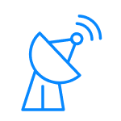

# LocationTracker

)

A React Native app to record GPS coordinates in the background and push it to a Firebase Realtime Database.

This is a companion app to the [Location Tracking Dashboard](https://github.com/MrF3lix/location-tracker-dashboard)